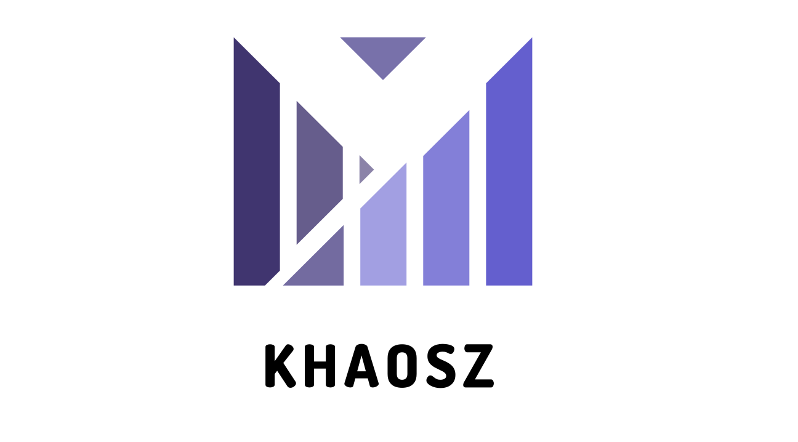

# KHAOSZ

这是一个支持中文和英文双语言的Transfomer模型，包含模型设置和训练流程， 通过加载`params/config.json` 中的设定的参数完成训练， 使用`train.py`解析命令行参数，包括数据集根目录、训练轮数、批处理大小、保存检查点的间隔轮数以及检查点保存目录。

模型的参数下载链接：https://huggingface.co/ViperEk/KHAOSZ

演示视频链接：https://www.bilibili.com/video/BV1z5RPYHEkd

训练数据集来源同样在以上链接中注明，请下载后放置于 params 目录

代码遵循 http://www.apache.org/licenses/LICENSE-2.0 协议， 使用时请注明代码来源

- **📊设备选择**：当前代码默认使用CUDA进行训练
- **🌐性能优化**：代码中设置了`dtype=torch.bfloat16`来启用训练，这有助于提高训练速度和降低显存消耗，但需确保硬件支持此特性。
- **🤖语言支持**：该模型目前支持在中文和英文数据集上训练， 在训练分词器时没有加入其他语言的文本，BBPE分词器不会存在OOV问题，但是对别的语言支持比较差

## 📌如何训练

要训练这个Transformer模型，您可以按照以下步骤进行操作：

**(1). 准备数据集：**

确保您的数据集位于一个指定的根目录下。数据集应包含用于训练的文本文件，这些文件可以是中文、英文或两者混合。
数据文件的格式应与模型的输入要求一致，最好是经过tokenizer处理过后的token_id, 为了节省内存占用采用torch.Tensor 存储id,(如果使用python的list, 在读取训练数据的时候内存占用大概是原来的两倍以上，因为python似乎是默认采用64位数精度存储的数据， 但是实际上int32足够)

**(2).安装依赖：**

确保您已经安装了所有必要的Python库：

```bash
conda env create -f environment.yml --name env_name
```

**(3).运行训练脚本：**

使用以下命令运行训练脚本，并根据需要调整参数：

```bash
python train.py \
--train_type=train_type[seq, sft, dpo] \
--data_root_path=/path/to/dataset \
--n_epoch=5 \
--batch_size=8 \
--max_lr=2e-4 \
--n_iter_ckpt=10000 \
--ckpt_dir checkpoints 
```
--train_type: 指定训练的类型，可选值有seq, sft, dpo

--data_root_path：指定数据集的根目录路径。

--n_epoch：指定训练的总轮数。

--batch_size：指定每个批次的样本数量。

--n_iter_step： 多少batch迭代一步

--warning_step: 预热步数

--max_lr: 指定过程中最大的学习率（学习率采用的是预热 + 余弦衰减）

--n_iter_ckpt：指定每多少迭代次数保存一次检查点。

--ckpt_dir：指定保存检查点的目录。

--resume_dir: 恢复训练的checkpoint路径

训练过程中，您可以在终端中查看训练日志(train_log.txt)，了解训练进度、损失值等信息。
检查点文件会保存在指定的检查点目录中，您可以使用这些检查点文件来恢复训练或进行评估。


## 👉如何使用

**(1).使用模型完成聊天：**

如果您想使用这个模型进行对话聊天, 请打开 chat.py 文件，并运行它。
或者， 您可以使用流式输出接口/对话生成接口完成对话

```python
from module import Khaosz

model = Khaosz("params")
model = model.to(device='cuda', dtype=torch.bfloat16)
histroy = []

while True:
    query = input(">> ")
    if query == "!exit":
        break
    
    response_size = 0
    for response, histroy in model.stream_generate(
        query=query, 
        history=histroy,
        temperature=0.85,
        top_p=0.95,
        top_k=50
    ):
        print(response[response_size:], end="")
        response_size = len(response)       

```

或者您可以使用非流式输出的方式完成对话

```python
from module import Khaosz

model = Khaosz("params")
model = model.to(device='cuda', dtype=torch.bfloat16)
histroy = []

while True:
    query = input(">> ")
    if query == "!exit":
        break
    
    response_size = 0
    response =  model.generate(
        query=query, 
        history=histroy,
        temperature=0.85,
        top_p=0.95,
        top_k=50
    )
    print(response)
```

**(2) 使用模型完成向量检索生成(RAG)：**

正在开发中...


## 📌其他问题
本模型基于20层的transformer，参数大致设置如`config.json`，参数大小为4亿（0.40b）

模型采用权重绑定， embedding层的权重和最后线性层的权重是共享的（比较小的模型都采用这种方式节省参数大小， 因为不采用权重绑定， embedding层假设有10000单词， 将会占用 10000 * 1024 = 102,400,000 参数， 也就是 0.1b 参数， 因为词表会占用太多的参数， 所以采用权重绑定是小模型的通用方法）

由于模型参数相对较少，在某些任务上可能会出现性能不足的情况，比如对复杂语言现象的理解能力可能不如更大规模的模型。此外，较小的模型也可能更容易过拟合训练数据，导致泛化能力较差。不过，这也意味着该模型可以在较低配置的硬件上运行，并且训练时间相对较短。

目前模型已经完成 pre-train + SFT + DPO 的流程， 相应的训练代码也存储在了项目当中