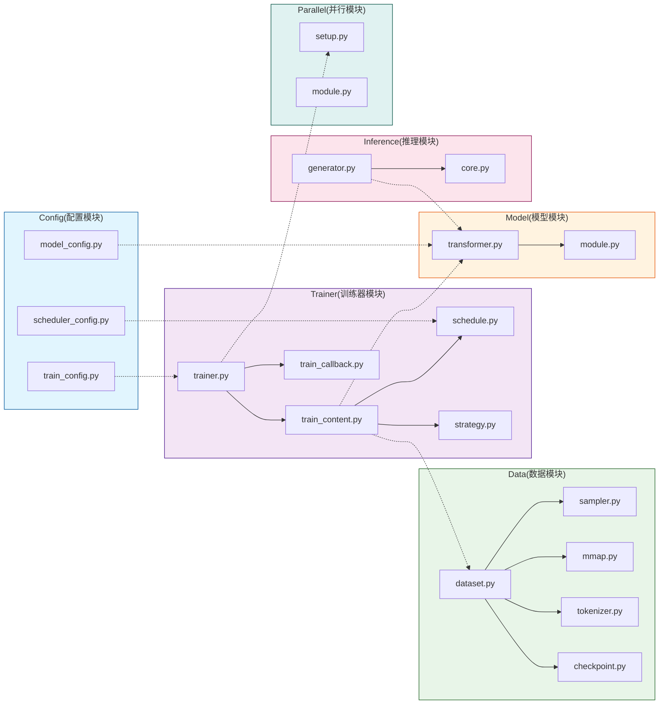

## 1. 为什么我要做这个项目？

现在市面上有很多大模型，比如GPT、LLaMA这些，动不动就是几十亿甚至上千亿参数。但说实话，这些模型对硬件要求太高了，普通开发者根本玩不起。我就想：**能不能做一个既好用又能在普通电脑上跑起来的模型呢？** 这其实也是目前大部分人的期望， 能有一个可以本地部署的ai小型项目，实现完全私有化并且有一定的智能能力。

于是就有了这个KHAOSZ项目，1B参数，中英双语，支持对话、文本生成、RAG检索，而且训练代码都是开源的！

## 2. 系统架构

系统分为以下板块

### 1. 配置管理（/config/）
- **模型配置**：定义模型结构参数（如层数、头数、维度等），通过 `ModelConfig` 统一管理。
- **训练配置**：设置训练参数（如批次大小、训练阶段 PT/SFT/DPO、优化器等），由 `TrainConfig` 加载。
- **调度配置**：控制学习率策略（如余弦退火）和训练进度。

### 2. 硬件与并行（/parallel/）
- **分布式初始化**：通过 `setup_parallel` 函数，根据配置初始化多卡/多机训练环境。

### 3. 数据处理（/data/）
- **高效加载**：使用内存映射（mmap）技术加载超大语料，避免内存溢出，实现零拷贝读取。

### 4. 模型与训练（/model/, /trainer/）
- **统一模型架构**：基于 Transformer，支持灵活配置不同规模（如7B、13B）。
- **策略化训练器**：`Trainer` 根据训练阶段（PT/SFT/DPO）自动切换训练策略，复用同一训练循环。
- **训练上下文管理**：统一管理模型、优化器、调度器和指标，支持多阶段无缝衔接。

### 5. 推理服务（/inference/, /utils/）
- **统一生成接口**：提供同步、批量、流式生成方法，适配所有训练阶段。
- **KV缓存优化**：在自回归生成中缓存 Key/Value，昇腾XPU下利用高速片上内存加速。
- **RAG支持**：结合检索器和嵌入模型，从外部知识库注入相关信息，提升回答质量。
- **智能文本分割**：
  - **结构优先分割**：按标题、段落等切分；
  - **语义分割**：基于句子嵌入相似度，确保片段语义完整，提升微调效果。

## 3. 训练流程

常见大语言模型（Large Language Model, LLM）的训练流程通常包含三个阶段：**预训练（Pre-training, PT）**、**监督微调（Supervised Fine-Tuning, SFT）** 以及 **基于人类反馈的强化学习（Reinforcement Learning from Human Feedback, RLHF）**。本系统设计支持全流程无缝衔接，通过模块化策略实现不同训练阶段的高效切换与状态管理，确保模型能力从通用语言理解逐步对齐至符合人类偏好的对话与指令执行。

### **2.1 预训练阶段**

预训练阶段旨在构建模型的基础语言能力与通用知识表示。该阶段在大规模、无标注的语料库（通常涵盖数百GB至数TB的文本数据）上进行自监督学习。模型架构基于标准的Transformer Decoder，通过掩码语言建模（如因果语言建模）目标进行训练，使模型能够学习词汇、语法、语义及蕴含于文本中的世界知识。

**核心公式：因果语言建模（Causal Language Modeling）**

$$
L_{\text{PT}} = - \sum_{t=1}^{T} \log P(x_t \mid x_{\lt t}; \theta)
$$

**符号说明：**

- $T$：序列长度
- $x_t$：序列中第 $ t $ 个词元（token）
- $x_{<t}$：位置 $ t $ 之前的所有词元
- $\theta$：模型参数
- $P(x_t \mid x_{<t}; \theta)$：模型在给定上文条件下预测下一个词元的概率

本阶段的核心在于利用分布式的并行计算资源，实现模型参数的稳定优化。训练器模块中的`PTStrategy`策略，专门负责管理预训练特有的数据采样、长序列分段与梯度累积逻辑。同时，硬件适配模块会根据运行环境（如华为昇腾NPU集群或标准GPU集群）自动选择最优的并行通信后端（如HCCL或NCCL），并进行计算图优化，以最大化硬件利用率和训练吞吐量。

另外系统通过数据模块中的高效内存映射加载器（`MmapFileHandler`），实现海量数据的零拷贝读取，以克服传统IO瓶颈。

### **2.2 监督微调阶段**

预训练模型虽具备强大的语言生成能力，但尚未对齐至遵循人类指令、进行安全有益对话的行为模式。监督微调阶段旨在弥合这一差距。该阶段使用由人工精心编写的、高质量的“指令-响应”配对数据集。

**核心公式：序列到序列条件语言建模**

设完整序列 $S = [s_1, s_2, \ldots, s_{P+L}]$，其中：

- 前 $P$ 个token是prompt 以及对应控制token： $X = [s_1, \ldots, s_P]$
- 后 $L$ 个token是response以及对应控制token： $Y = [s_{P+1}, \ldots, s_{P+L}]$

损失函数为：

$$
L_{\text{SFT}} = - \sum_{t=P+1}^{P+L} \log P(s_t \mid s_{\lt t}; \theta)
$$

训练器模块将动态切换到`SFTStrategy`策略。此策略的核心是引入序列级的监督学习目标，例如预测给定指令下完整、正确的响应序列。训练上下文管理器（`TrainContext`）负责平滑地从PT阶段检查点加载模型状态，并初始化新的优化器和学习率调度器。本阶段不仅优化模型参数，更重要的是引导模型学习“对话”这一特定任务范式，使其输出风格、内容与格式均符合人类期望。

### **2.3 基于人类反馈的强化学习阶段**

为生成更具帮助性、无害性且符合人类偏好的高质量输出，系统进一步集成强化学习阶段。传统的RLHF流程包括**奖励模型训练**与**策略模型微调**两个核心步骤。系统支持以直接偏好优化(Direct Preference Optimization，DPO)算法为代表的策略微调，并针对稳定性与收敛性进行了多项工程优化。

#### **2.3.1 传统 RLHF（奖励模型训练）**

$$
L_{\text{RM}} = -\mathbb{E}_{(x, y_w, y_l) \sim D} \left[ \log \sigma\left( r_\phi(x, y_w) - r_\phi(x, y_l) \right) \right]
$$

**符号说明：**

- $r_\phi(x, y)$：参数为 $phi$ 的奖励模型给出的标量分数
- $y_w, y_l $：同一提示 $ x $ 下的优选和劣选回答
- $\sigma $：sigmoid 函数
- $\mathcal{D} $：人类偏好数据集

#### **2.3.2 DPO 直接偏好优化**（推荐）

$$
L_{\text{DPO}} = -E_{(x, y_w, y_l) \sim D} \left[ \log \sigma\left( \beta \log \frac{\pi_\theta(y_w \mid x)}{\pi_{\text{ref}}(y_w \mid x)} - \beta \log \frac{\pi_\theta(y_l \mid x)}{\pi_{\text{ref}}(y_l \mid x)} \right) \right]
$$

**符号说明：**

- $\pi_\theta(y \mid x) $：当前策略模型生成回答的概率
- $\pi_{\text{ref}}(y \mid x) $：参考模型生成回答的概率
- $\beta $：温度参数（通常设为 0.1-0.5）
- 注意：隐式学习奖励函数 $r(x, y) = \beta \log \frac{\pi_\theta(y \mid x)}{\pi_{\text{ref}}(y \mid x)} $

在本阶段，训练器模块启用`RLHFStrategy`策略（或类似的`DPOStrategy`直接偏好优化策略）。该策略管理一个复杂的训练循环，其中包含策略模型（待优化的LLM）、参考模型（通常为SFT后的模型快照）和奖励模型。系统流程如下：

1. **偏好数据收集与奖励建模**：首先，通过收集人类标注员对同一提示词下多个模型生成结果的排序偏好数据，训练一个独立的奖励模型（Reward Model, RM）。该模型学习为生成文本输出一个标量奖励分数，以量化其符合人类偏好的程度。
2. **策略优化**：随后，使用奖励模型作为优化信号，通过强化学习算法对SFT模型（作为策略）进行微调。策略优化的目标是最大化从奖励模型获得的期望累计奖励，同时通过KL散度惩罚项约束策略模型与参考模型的输出分布不过度偏离，以防止模式崩溃并保持生成多样性。训练上下文管理器在此阶段同时维护策略模型、参考模型和奖励模型（或价值函数模型）的状态，并协调复杂的多阶段梯度计算。

通过上述三阶段的递进式训练，模型完成了从通用语言基座到专业化、高对齐度对话智能体的进化。系统通过统一的`Trainer`接口和策略模式设计，使得各阶段训练在代码层面高度复用，在流程层面清晰解耦，为大规模语言模型的研发与迭代提供了高效、灵活且可扩展的工程基础。
