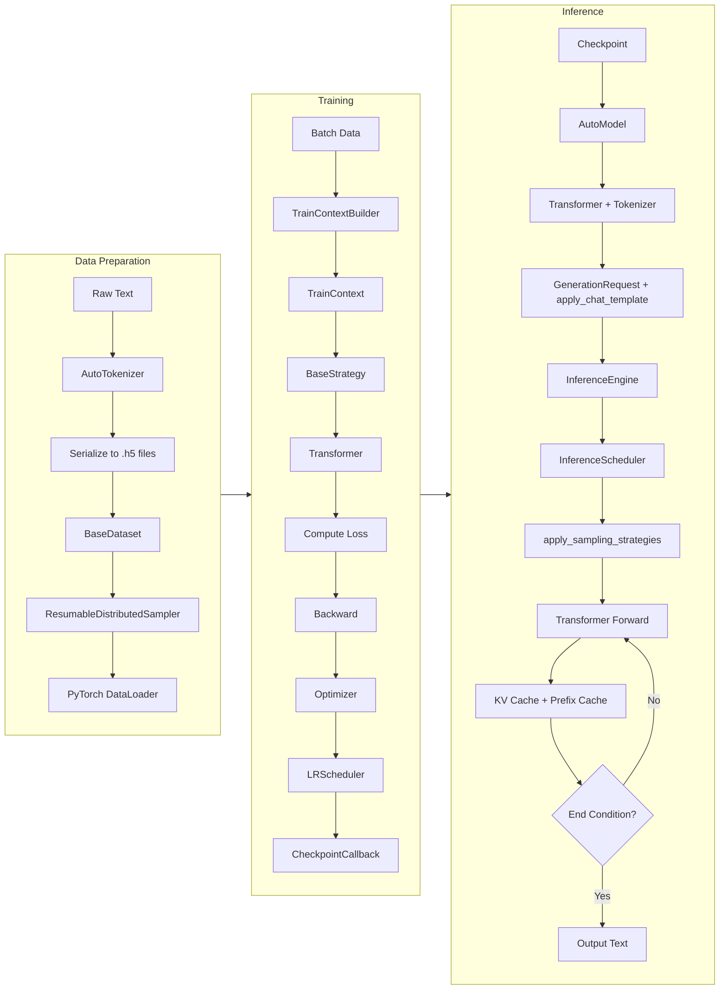

# AstrAI Data Flow Documentation

This document describes the data flow of the AstrAI project (a training and inference framework for autoregressive Transformer language models). It covers the complete flow from raw data to model training and inference.

## Overview

AstrAI adopts a modular design with the following main components:
- **Dataset Module** (`astrai/dataset/`): Dataset, sampler, serialization tools
- **Model Module** (`astrai/model/`): AutoModel, Transformer model and its submodules
- **Training Module** (`astrai/trainer/`): Trainer, training context, strategies, schedulers
- **Inference Module** (`astrai/inference/`): Inference engine with continuous batching, streaming generation
- **Config Module** (`astrai/config/`): Model, training, scheduler, and other configurations
- **Factory Module** (`astrai/factory/`): Registry, BaseFactory for component registration
- **Parallel Module** (`astrai/parallel/`): Distributed training support
- **Serialization Module** (`astrai/serialization/`): HDF5 data loading, checkpoint management

The data flow can generally be divided into two main lines: **Training Data Flow** and **Inference Data Flow**.

## Data Flow Diagram

## Detailed Module Descriptions

### 1. Dataset Module

#### 1.1 Serialization (`serialization.py`)
- **`save_h5`**: Saves multiple tensors by groups as HDF5 files (`.h5`), each key corresponds to a list of tensors
- **`load_h5`**: Loads `.h5` files, returns `Dict[str, List[Tensor]]`, supports shared memory (`share_memory=True`)
- **`Checkpoint` class**: Encapsulates model state dict, training epoch, iteration count; supports safetensors format for saving and loading

#### 1.2 Dataset (`dataset.py`)
- **`BaseDataset`**: Abstract base class, defines common logic for window sampling, stride, etc.
- **`BaseSegmentFetcher`** and **`MultiSegmentFetcher`**: Efficiently fetch data from specified index ranges in multiple segments
- **`DatasetFactory`**: Factory pattern, supports dynamic registration of dataset types (`seq`, `sft`, `dpo`, `grpo`)
- After dataset loading, multiple data keys (such as `"sequence"`, `"mask"`) are managed through `MultiSegmentFetcher`

#### 1.3 Sampler (`sampler.py`)
- **`ResumableDistributedSampler`**: Resumable sampler supporting distributed training
- Records current epoch and iteration position, enabling training resume from breakpoints
- Supports shuffle and drop_last options

### 2. Model Module

#### 2.1 Transformer / AutoModel (`transformer.py`, `automodel.py`)
- **`AutoModel`**: Base class for autoregressive language models with `from_pretrained()` and `save_pretrained()` methods
- **`Transformer`**: Core autoregressive decoder architecture (registered via `@AutoModel.register('transformer')`)
- Contains embedding layer, multi-layer `DecoderBlock`, RMSNorm, and linear output head
- Supports weight tying (`tie_weight=True`) to reduce parameter count
- Uses Rotary Position Embedding (RoPE) to inject position information
- Supports loading from safetensors format with automatic model type detection from `config.json`

#### 2.2 Submodules (`module.py`)
- **`RotaryEmbedding`**: Generates RoPE cos/sin cache
- **`DecoderBlock`**: Contains multi-head attention (supports GQA and MLA), feedforward network (FFN), residual connections
- **`GQA`**: Grouped Query Attention implementation
- **`MLA`**: Multi-Latent Attention implementation (like Qwen2-VL)
- **`MLP`**: Feed-forward network with SiLU activation and gated mechanism
- **`RMSNorm`**: Layer normalization variant
- **`Linear`**, **`Embedding`**: Custom linear layer and embedding layer, supporting parallelism wrappers

### 3. Training Module

#### 3.1 Training Context (`train_context.py`)
- **`TrainContext`**: Data class encapsulating all components needed for training (model, optimizer, data loader, strategy, etc.)
- **`TrainContextBuilder`**: Builder pattern, progressively assembles training context, supports resume from checkpoint

#### 3.2 Trainer (`trainer.py`)
- **`Trainer`**: Main training loop, manages callbacks (progress bar, checkpoint, metric logging, gradient clipping, scheduler)
- Supports distributed training (launches multi-process via `spawn_parallel_fn`)
- Training steps include:
  1. `on_train_begin` → 2. `on_epoch_begin` → 3. `on_batch_begin` → 4. Forward/loss calculation → 5. `on_batch_end` → 6. Gradient accumulation → 7. `on_step_begin` → 8. Optimizer update → 9. `on_step_end` → 10. `on_epoch_end`

#### 3.3 Strategy (`strategy.py`)
- **`BaseStrategy`**: Defines training strategy interface
- **`SEQStrategy`**: Standard next-token prediction training
- **`SFTStrategy`**: Supervised Fine-tuning with loss masking
- **`DPOStrategy`**: Direct Preference Optimization
- **`GRPOStrategy`**: Group Relative Policy Optimization
- Strategy receives batch data, executes model forward pass, loss calculation, returns loss tensor
- Created dynamically by `StrategyFactory` according to configuration

#### 3.4 Scheduler (`schedule.py`)
- **`BaseScheduler`**: Abstract base class defining learning rate scheduling interface
- **`CosineScheduler`**: Cosine decay scheduler with warmup
- **`SGDRScheduler`**: Stochastic Gradient Descent with Warm Restarts
- **`SchedulerFactory`**: Factory pattern, supports registration of various schedulers
- Scheduler is automatically created according to configuration and bound to optimizer

#### 3.5 Callbacks (`train_callback.py`)
- **`TrainCallback`**: Protocol interface for trainer callbacks
- **`CheckpointCallback`**: Saves model checkpoints at configurable intervals
- **`ProgressBarCallback`**: Displays training progress
- **`MetricLoggerCallback`**: Logs training metrics to JSON files
- **`GradientClippingCallback`**: Clips gradient norms
- **`SchedulerCallback`**: Steps learning rate scheduler

### 4. Factory Module

#### 4.1 Registry and BaseFactory (`factory.py`)
- **`Registry`**: Flexible registry for component classes with category and priority support
- **`BaseFactory`**: Generic factory class for component registration and creation
- Supports decorator-based registration pattern for extensible components
- Provides methods for registration, retrieval, and listing with filtering

### 5. Parallel Module

#### 5.1 Setup (`setup.py`)
- **`spawn_parallel_fn`**: Spawns multiple processes for distributed training using PyTorch multiprocessing
- **`setup_parallel`**: Context manager for initializing distributed process group (NCCL/CCL backend)
- **`only_on_rank`**: Decorator to execute functions only on specific ranks
- **`get_rank`**: Returns current process rank in distributed group
- **`get_world_size`**: Returns total number of processes in distributed group
- **`get_current_device`**: Returns current device from environment

#### 5.2 Parallel Layers (`module.py`)
- **`ParallelModel`**: Base class for parallel models with process group
- **`ColumnParallelLinear`**: Column-parallel linear layer with input splitting and output gathering
- **`RowParallelLinear`**: Row-parallel linear layer with output reduction

### 6. Inference Module

#### 6.1 Inference Engine (`engine.py`)
- **`InferenceEngine`**: Unified inference interface, supports streaming and non-streaming generation
- **`InferenceScheduler`**: Continuous batching scheduler with dynamic batch composition
- **`GenerationRequest`**: Encapsulates generation parameters (top_k, top_p, temperature, max_len, messages, etc.)
- **`messages` format**: List of message dictionaries with `role` (system/user/assistant) and `content`
- **`apply_chat_template`** (from `tokenizer.py`): Converts messages into prompt string using ChatML format
- Provides streaming (`stream=True`) and non-streaming (`stream=False`) generation interfaces
- Supports continuous batching with `max_batch_size` and `max_seq_len` parameters
- Uses separate model and tokenizer initialization for flexibility

#### 6.2 Scheduler (`scheduler.py`)
- **`Task`**: Individual generation task with state management (PENDING, RUNNING, FINISHED, ABORTED)
- **`TaskStatus`**: Task state enumeration
- **`apply_sampling_strategies`**: Applies temperature, top-k, top-p sampling to logits
- **`PrefixCacheManager`**: Radix tree-based prefix cache with LRU eviction for efficient KV cache reuse
- **`RadixNode`**: Tree node structure for prefix caching
- Continuous batching: new requests can join at any time, completed requests are released immediately

#### 6.3 Server (`server.py`)
- FastAPI-based HTTP inference server
- OpenAI-compatible `/v1/chat/completions` endpoint
- Health check and statistics endpoints
- Supports both streaming and non-streaming responses

### 7. Tokenizer Module

#### 7.1 Tokenizer (`tokenizer.py`)
- Implemented based on HuggingFace tokenizers library (Byte-Level BPE)
- **`AutoTokenizer`**: Auto-loading tokenizer class
- Supports special tokens: `<｜begin▁of▁sentence｜>`, `<｜end▁of▁sentence｜>`, `<｜▁pad▁｜>`, `<｜im▁start｜>`, `<｜im▁end｜>`
- Provides `encode`/`decode` methods for mutual conversion between text and token IDs
- Uses `AutoTokenizer` for loading pre-trained tokenizers

#### 7.2 Chat Template (`chat_template.py`)
- **`ChatTemplate`**: Jinja2-based chat template with rendering support
- Handles multi-role message formatting (system, user, assistant)
- Supports dynamic prompts and generation prompts

## Training Data Flow - Detailed Steps

1. **Data Preparation**
   - Raw text is converted to token ID sequences through AutoTokenizer
   - Token ID sequences (possibly with masks, labels, etc.) are saved by groups as `.h5` files
   - Files can contain multiple segments, each segment corresponds to a tensor

2. **Dataset Loading**
   - `BaseDataset`'s `load` method calls `load_h5`, obtaining `segments` dictionary
   - Create `MultiSegmentFetcher` to manage data for multiple keys
   - Calculate total sample count, and determine start/end indices for each sample based on window size and stride

3. **Sampling and Batch Loading**
   - `ResumableDistributedSampler` generates index sequence based on current epoch and iteration position
   - PyTorch `DataLoader` uses sampler to get indices, calls dataset's `__getitem__` to get actual data
   - Batch data shape is `[batch_size, window_size]` (or varies according to specific dataset type)

4. **Strategy Forward and Loss Calculation**
   - Batch data is passed to strategy (such as `SEQStrategy`)
   - Strategy internally calls `Transformer` model, obtaining logits
   - Calculate cross-entropy loss (or DPO loss, etc.) according to task type
   - Return loss tensor

5. **Backpropagation and Optimization**
   - Loss is normalized by dividing by accumulation steps, then `loss.backward()` is executed
   - After accumulating `accumulation_steps` batches, optimizer `step()` and `zero_grad()` are executed
   - Learning rate scheduler updates learning rate after each step

6. **Checkpoint Saving**
   - `CheckpointCallback` saves checkpoints at set intervals
   - Checkpoints contain model state dict, current epoch, iteration, and other metadata
   - Saved in safetensors format, ensuring safety and efficiency

## Inference Data Flow - Detailed Steps

1. **Model Loading**
   - Load `Transformer` model from checkpoint via `AutoModel.from_pretrained()`
   - Set model to evaluation mode (`model.eval()`), enable inference mode (`torch.inference_mode`)

2. **Prompt Construction and Encoding**
   - User messages (list of dict with role and content) are converted to ChatML format string through `apply_chat_template` method in tokenizer
   - Tokenizer encodes prompt string to token ID sequence `input_ids`
   - For batch generation, use `pad_sequence` for padding

3. **Autoregressive Generation Loop**
   - Initialize KV cache (optional) and prefix cache
   - Loop until generating `max_len` tokens or encountering stop token:
     - Input current `input_ids` (or cached new token) to model, obtain `logits`
     - Apply `apply_sampling_strategies` (temperature, top-k, top-p) to `logits`
     - Sample next token ID from the processed distribution
     - Append new token to `input_ids`, while updating KV cache
     - For streaming generation, yield each token to caller immediately

4. **Decoding and Output**
   - Decode generated token ID sequence to text through tokenizer
   - Remove special tokens, return plain text response

## Checkpoint and Serialization

- **Training Checkpoint**: Saves model parameters, optimizer state, scheduler state, current epoch and iteration
- **Model Parameters**: Supports safetensors format, automatically handles special logic like weight tying during loading
- **Dataset Serialization**: HDF5 format supports efficient random access and shared memory, suitable for large-scale pre-training data

## Summary

The data flow design of AstrAI reflects the characteristics of modularity, extensibility, and resumability. The training data flow supports large-scale distributed training through chunk loading, resumable sampling, gradient accumulation, and other mechanisms; the inference data flow achieves efficient text generation using KV cache, prefix caching, and sampling strategies. Clear interfaces between modules facilitate customization and extension.

> Document Update Time: 2026-04-09