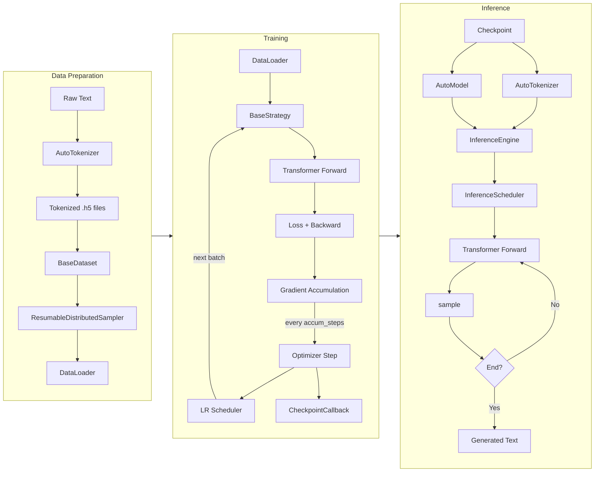

# AstrAI Data Flow Documentation

This document describes the data flow of the AstrAI project (a training and inference framework for autoregressive Transformer language models). It covers the complete flow from raw data to model training and inference.

## Overview

AstrAI adopts a modular design with the following main components:
- **Dataset Module** (`astrai/dataset/`): Dataset, sampler, serialization tools
- **Model Module** (`astrai/model/`): AutoModel, Transformer model and its submodules
- **Training Module** (`astrai/trainer/`): Trainer, training context, strategies, schedulers, callbacks, metric utilities
- **Inference Module** (`astrai/inference/`): Inference engine with continuous batching, streaming generation
- **Config Module** (`astrai/config/`): ModelConfig, TrainConfig
- **Factory Module** (`astrai/factory/`): Registry, BaseFactory for component registration
- **Parallel Module** (`astrai/parallel/`): Distributed training support
- **Serialization** (`astrai/serialization.py`): HDF5 data loading, checkpoint management

## Data Flow Diagram



## Detailed Module Descriptions

### 1. Serialization (`astrai/serialization.py`)

- **`save_h5`**: Saves tensors by groups as HDF5 files (`.h5`), each key maps to a list of tensors
- **`load_h5`**: Loads `.h5` files, returns `Dict[str, List[Tensor]]`, supports shared memory
- **`Checkpoint`**: Encapsulates model state dict + epoch + iteration; uses safetensors

### 2. Dataset Module

#### 2.1 Dataset (`dataset.py`)
- **`BaseDataset`**: Abstract base class for windowed sequence sampling
- **`BaseSegmentFetcher` / `MultiSegmentFetcher`**: Fetch tensor segments by index range
- **`DatasetFactory`**: Creates dataset instances by `train_type` (`seq`, `sft`, `dpo`, `grpo`)
- Data keys: `"sequence"` (SEQ), `"loss_mask"` (SFT), `"chosen_mask"/"rejected_mask"` (DPO), `"masks"` (GRPO)

#### 2.2 Sampler (`sampler.py`)
- **`ResumableDistributedSampler`**: Tracks `epoch` and `iter` for breakpoint resume; supports shuffle and drop_last

### 3. Model Module

#### 3.1 Transformer / AutoModel
- **`AutoModel`**: Base class with `from_pretrained()` / `save_pretrained()`
- **`Transformer`**: Decoder-only architecture, registered via `@AutoModel.register('transformer')`
- Embedding → N×DecoderBlock → RMSNorm → Linear lm_head
- RoPE position encoding, optional weight tying

#### 3.2 Submodules (`module.py`)
- **`DecoderBlock`**: GQA attention + residual + MLP + RMSNorm
- **`GQA`**: Grouped Query Attention (also `MLA` for multi-latent attention)
- **`MLP`**: `SiLU(gate(x)) * up(x)` → down projection
- **`RotaryEmbedding`**: RoPE cos/sin cache
- **`RMSNorm`**: Layer normalization

### 4. Training Module

#### 4.1 Training Context (`train_context.py`)
- **`TrainContext`**: Dataclass holding model, optimizer, dataloader, strategy, scheduler, checkpoint state
- **`TrainContextBuilder`**: Builder pattern — takes checkpoint for resume, builds all components

#### 4.2 Trainer (`trainer.py`)

The training loop is nested: **epoch** → **batch** (with step phase interspersed):

```
on_train_begin
  on_epoch_begin
    for each batch:
      if iteration % accumulation_steps == 0:        ← step phase
        on_step_begin → optimizer.step() → zero_grad → on_step_end
                                                      ← batch phase
      on_batch_begin → strategy(batch) → loss → backward → on_batch_end
      iteration += 1

    on_epoch_end
on_train_end
```

Key points:
- `on_step_*` wraps optimizer step (fires every `accumulation_steps` batches)
- `on_batch_*` wraps loss computation (fires every batch)
- `SchedulerCallback` fires on `on_batch_end` — LR scheduler steps every batch
- `GradientClippingCallback` fires on `on_step_begin`

#### 4.3 Strategy (`strategy.py`)
- **`SEQStrategy`**: Next-token prediction, cross-entropy with label smoothing
- **`SFTStrategy`**: Supervised fine-tuning with loss masking
- **`DPOStrategy`**: Direct Preference Optimization with reference model
- **`GRPOStrategy`**: Group Relative Policy Optimization with clipped ratio

#### 4.4 Scheduler (`schedule.py`)
- **`CosineScheduler`**: Cosine decay + linear warmup
- **`SGDRScheduler`**: Cosine annealing with warm restarts
- Created by `SchedulerFactory` and bound to optimizer

#### 4.5 Callbacks
- **`CheckpointCallback`**: Saves safetensors at `ckpt_interval` iterations
- **`ProgressBarCallback`**: tqdm progress display
- **`MetricLoggerCallback`**: Writes JSONL metrics to `{ckpt_dir}/logs/`
- **`GradientClippingCallback`**: `clip_grad_norm_` on `on_step_begin`
- **`SchedulerCallback`**: `scheduler.step()` on `on_batch_end`

### 5. Inference Module

#### 5.1 Inference Engine (`engine.py`)
- **`InferenceEngine`**: Facade over scheduler; provides `generate()`, `generate_with_request()`, `generate_async()`
- Accepts `prompt: str | List[str]`, returns generator (stream) or string (non-stream)

#### 5.2 Scheduler 4-Phase Loop (`scheduler.py`)

Background thread runs continuously:

```
1. Cleanup → Remove finished tasks, free KV cache pages
2. Refill  → Pop from waiting_queue, alloc pages, add to active
3. Prefill → Group active tasks by prompt_len, run full forward pass
4. Decode  → Pick largest same-position group, run single-token forward
```

- **`Task`**: Tracks prompt_ids, output_ids, page_table, status (PENDING/RUNNING/FINISHED/ABORTED)
- **`PagedCache`**: Bitmask-based page allocator with page-table-indirected read/write
- **`CacheView`**: Batch view bundling cache + page table for attention layers
- **`sample()`**: Temperature → top-k → top-p → multinomial

#### 5.3 Server (`server.py`)
- FastAPI with OpenAI `/v1/chat/completions` and Anthropic `/v1/messages` endpoints
- Streaming via SSE, health check at `/health`, stats at `/stats`

### 6. Tokenizer Module

- **`AutoTokenizer`**: Wraps HuggingFace tokenizers (BBPE); `encode`/`decode`/`apply_chat_template`
- **`ChatTemplate`**: Jinja2-based template rendering for multi-turn chat

### 7. Factory & Parallel

- **`Registry` / `BaseFactory`**: Decorator-based component registration
- **`spawn_parallel_fn`**: Multi-process DDP launcher with NCCL backend
- **`ParallelModel` / `ColumnParallelLinear` / `RowParallelLinear`**: Tensor model parallelism

## Training Data Flow — Detailed Steps

1. **Data Preparation**
   - Raw text → token IDs via `AutoTokenizer.encode()`
   - Save as `.h5` files (groups of tensor lists per data key)

2. **Dataset Loading**
   - `BaseDataset.load()` calls `load_h5()`, builds `MultiSegmentFetcher`
   - Sliding window of `window_size` with `stride` determines sample boundaries

3. **Sampling & Batching**
   - `ResumableDistributedSampler` produces shuffled index sequences
   - `DataLoader` fetches `[batch_size, window_size]` tensors via `__getitem__`

4. **Strategy Forward**
   - Strategy receives batch, calls `Transformer.forward()` for logits
   - Computes task-specific loss (cross-entropy, DPO, GRPO)

5. **Backward & Accumulation**
   - `loss = raw_loss / accumulation_steps`
   - `loss.backward()` accumulates gradients
   - Every `accumulation_steps` batches: `optimizer.step()` → `zero_grad()`
   - Every batch: `scheduler.step()` updates learning rate

6. **Checkpoint**
   - `CheckpointCallback` saves `model.state_dict()` + metadata to safetensors at `ckpt_interval` iterations
   - Does NOT save optimizer/scheduler state (resume resets those)

## Inference Data Flow — Detailed Steps

1. **Model Loading**
   - `AutoModel.from_pretrained(path)` loads weights from safetensors
   - `torch.inference_mode()` wraps generation

2. **Prompt Construction**
   - Messages → `apply_chat_template(messages, tokenize=False)` → prompt string
   - `tokenizer.encode(prompt)` → token IDs (truncated to `max_prompt_len`)

3. **Continuous Batching Loop**
   - **Cleanup**: Finished tasks → `stream_callback(STOP)`, free KV pages
   - **Refill**: Pop from waiting queue, `PagedCache.alloc_n()` for prompt pages
   - **Prefill**: Group by prompt length, run full forward with `start_pos=0`
   - **Decode**: Pick position group with most tasks, single-token forward:
     - Model forward → `logits` → `sample()` → next token ID
     - Append to `output_ids`, update `output_tokens`
     - `_maybe_alloc_page()` grows page table as needed
     - `stream_callback(token)` for streaming clients

4. **Output**
   - `tokenizer.decode(output_ids)` → text
   - Return to caller (streaming: token-by-token; non-streaming: complete string)

## Checkpoint & Serialization

- **Training Checkpoint**: safetensors weights + epoch/iteration metadata. Optimizer/scheduler state is NOT persisted.
- **Inference Loading**: `AutoModel.from_pretrained()` loads from the same safetensors format.
- **Dataset Serialization**: HDF5 with shared memory support for large-scale pre-training data.

> Document Update Time: 2026-05-09
