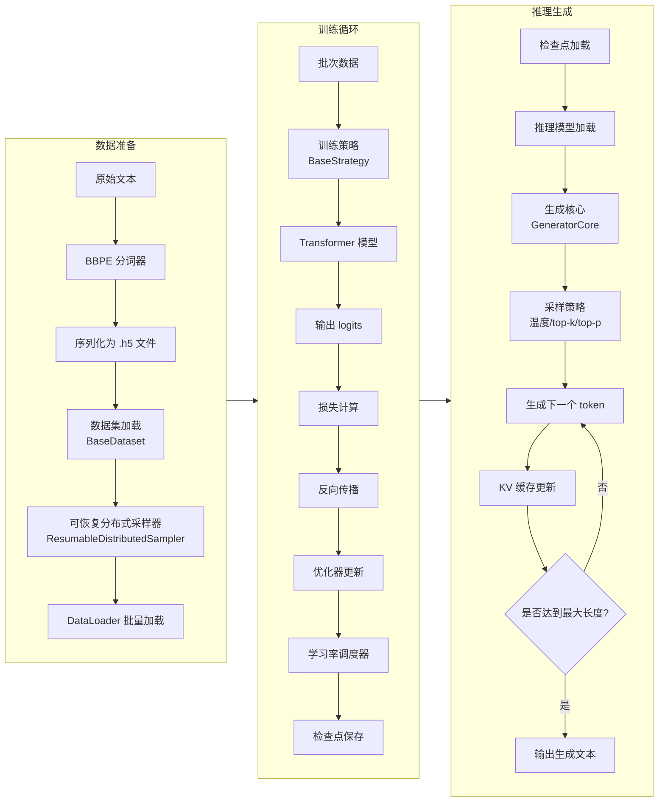

# KHAOSZ 数据流文档

本文档描述 KHAOSZ 项目（一个自回归 Transformer 语言模型的训练与推理框架）的数据流。涵盖从原始数据到模型训练、推理的完整流程。

## 概述

KHAOSZ 采用模块化设计，主要组件包括：
- **数据模块** (`khaosz/data/`): 数据集、采样器、分词器、序列化工具
- **模型模块** (`khaosz/model/`): Transformer 模型及其子模块
- **训练模块** (`khaosz/trainer/`): 训练器、训练上下文、策略、调度器
- **推理模块** (`khaosz/inference/`): 生成核心、KV 缓存管理、流式生成
- **配置模块** (`khaosz/config/`): 模型、训练、调度等配置
- **并行模块** (`khaosz/parallel/`): 分布式训练支持

数据流总体可分为 **训练数据流** 与 **推理数据流** 两条主线。

## 数据流图

## 各模块详细说明

### 1. 数据模块

#### 1.1 分词器 (`tokenizer.py`)
- 基于 Byte‑Level BPE (BBPE) 实现
- 支持特殊 token：`<bos>`, `<eos>`, `<pad>`, `<|im_start|>`, `<|im_end|>`
- 提供 `encode`/`decode` 方法，将文本与 token ID 相互转换
- 训练时从语料库学习词汇表，保存为 `.json` 文件

#### 1.2 序列化 (`serialization.py`)
- **`save_h5`**: 将多个张量按组保存为 HDF5 文件（`.h5`），每个键对应一个张量列表
- **`load_h5`**: 加载 `.h5` 文件，返回 `Dict[str, List[Tensor]]`，支持共享内存 (`share_memory=True`)
- **`Checkpoint` 类**: 封装模型状态字典、训练轮次、迭代次数，支持 safetensors 格式保存与加载

#### 1.3 数据集 (`dataset.py`)
- **`BaseDataset`**: 抽象基类，定义窗口采样、步长等通用逻辑
- **`BaseSegmentFetcher`** 与 **`MultiSegmentFetcher`**: 高效地从多个分段中获取指定索引范围的数据
- **`DatasetFactory`**: 工厂模式，支持动态注册数据集类型（`seq`, `sft`, `dpo`, `grpo`）
- 数据集加载后通过 `MultiSegmentFetcher` 管理多个数据键（如 `"sequence"`, `"mask"`）

#### 1.4 采样器 (`sampler.py`)
- **`ResumableDistributedSampler`**: 支持分布式训练的可恢复采样器
- 记录当前 epoch 和迭代位置，便于从断点继续训练
- 支持 shuffle 与 drop_last 选项

### 2. 模型模块

#### 2.1 Transformer (`transformer.py`)
- 核心自回归解码器架构
- 包含嵌入层、多层 `DecoderBlock`、RMSNorm 和线性输出头
- 支持权重绑定 (`tie_weight=True`) 以减小参数量
- 使用 Rotary Position Embedding (RoPE) 注入位置信息

#### 2.2 子模块 (`module.py`)
- **`RotaryEmbedding`**: 生成 RoPE 的 cos/sin 缓存
- **`DecoderBlock`**: 包含多头注意力（支持 GQA）、前馈网络（FFN）、残差连接
- **`RMSNorm`**: 层归一化变体
- **`Linear`**, **`Embedding`**: 自定义线性层与嵌入层，支持并行化包装

### 3. 训练模块

#### 3.1 训练上下文 (`train_context.py`)
- **`TrainContext`**: 数据类，封装训练所需的所有组件（模型、优化器、数据加载器、策略等）
- **`TrainContextBuilder`**: 构建器模式，逐步组装训练上下文，支持从检查点恢复

#### 3.2 训练器 (`trainer.py`)
- **`Trainer`**: 主训练循环，管理回调函数（进度条、检查点、指标记录、梯度裁剪、调度器）
- 支持分布式训练（通过 `spawn_parallel_fn` 启动多进程）
- 训练步骤包括：
  1. `on_train_begin` → 2. `on_epoch_begin` → 3. `on_batch_begin` → 4. 前向/损失计算 → 5. `on_batch_end` → 6. 梯度累积 → 7. `on_step_begin` → 8. 优化器更新 → 9. `on_step_end` → 10. `on_epoch_end`

#### 3.3 策略 (`strategy.py`)
- **`BaseStrategy`**: 定义训练策略接口（如 `SeqStrategy`, `SFTStrategy`, `DPOStrategy`）
- 策略接收批次数据，执行模型前向传播、损失计算，返回 loss 张量
- 由 `StrategyFactory` 根据配置动态创建

#### 3.4 调度器 (`schedule.py`)
- **`BaseScheduler`**: 抽象基类，定义学习率调度接口
- **`SchedulerFactory`**: 工厂模式，支持注册多种调度器（如 `cosine`, `sgdr`）
- 调度器根据配置自动创建，并与优化器绑定

### 4. 推理模块

#### 4.1 生成核心 (`core.py`)
- **`GeneratorCore`**: 提供 `generate_iterator` 方法，执行单步生成
- 应用采样策略（温度、top‑k、top‑p）对 logits 进行筛选
- 支持 KV 缓存以加速自回归生成

#### 4.2 KV 缓存管理 (`core.py`)
- **`KVCacheManager`**: 管理每层的 K 和 V 缓存，支持批量生成与长度扩展
- 缓存形状为 `[batch_size, n_kv_heads, seq_len, head_dim]`

#### 4.3 生成器 (`generator.py`)
- **`GenerationRequest`**: 封装生成请求参数（top_k, top_p, temperature, max_len, query, history 等）
- **`build_prompt`**: 将查询与历史记录转换为 ChatML 格式的提示字符串
- **`pad_sequence`**: 对输入 ID 进行填充，使其长度一致
- 提供流式与非流式生成接口

## 训练数据流详细步骤

1. **数据准备**
   - 原始文本经过 BBPE 分词器转换为 token ID 序列
   - 将 token ID 序列（可能带有掩码、标签等）按组保存为 `.h5` 文件
   - 文件可包含多个分段，每个分段对应一个张量

2. **数据集加载**
   - `BaseDataset` 的 `load` 方法调用 `load_h5`，得到 `segments` 字典
   - 创建 `MultiSegmentFetcher` 管理多个键的数据
   - 计算总样本数，并根据窗口大小、步长确定每个样本的起始/结束索引

3. **采样与批量加载**
   - `ResumableDistributedSampler` 根据当前 epoch 和迭代位置生成索引序列
   - `DataLoader` 使用采样器获取索引，调用数据集的 `__getitem__` 获取实际数据
   - 批量数据形状为 `[batch_size, window_size]`（或根据具体数据集类型变化）

4. **策略前向与损失计算**
   - 批次数据传入策略（如 `SeqStrategy`）
   - 策略内部调用 `Transformer` 模型，得到 logits
   - 根据任务类型计算交叉熵损失（或 DPO 损失等）
   - 返回 loss 张量

5. **反向传播与优化**
   - 损失除以累积步数进行归一化，然后执行 `loss.backward()`
   - 每累积 `accumulation_steps` 个批次后，执行优化器 `step()` 和 `zero_grad()`
   - 学习率调度器在每个 step 后更新学习率

6. **检查点保存**
   - `CheckpointCallback` 按设定的间隔保存检查点
   - 检查点包含模型状态字典、当前 epoch、iteration 等元数据
   - 使用 safetensors 格式保存，确保安全与效率

## 推理数据流详细步骤

1. **模型加载**
   - 从检查点加载 `Transformer` 模型与分词器
   - 模型设置为评估模式 (`model.eval()`)，启用推理模式 (`torch.inference_mode`)

2. **提示构建与编码**
   - 用户查询与历史记录通过 `build_prompt` 转换为 ChatML 格式字符串
   - 分词器将提示字符串编码为 token ID 序列 `input_ids`
   - 若为批量生成，使用 `pad_sequence` 进行填充

3. **自回归生成循环**
   - 初始化 KV 缓存（可选）
   - 循环直到生成 `max_len` 个 token 或遇到停止 token：
     - 将当前 `input_ids`（或缓存后的新 token）输入模型，得到 `logits`
     - 对 `logits` 应用 `apply_sampling_strategies`（温度、top‑k、top‑p）
     - 从处理后的分布中采样得到下一个 token ID
     - 将新 token 追加到 `input_ids`，同时更新 KV 缓存
     - 若为流式生成，每生成一个 token 立即 yield 给调用方

4. **解码与输出**
   - 将生成的 token ID 序列通过分词器解码为文本
   - 去除特殊 token，返回纯文本响应

## 检查点与序列化

- **训练检查点**：保存模型参数、优化器状态、调度器状态、当前 epoch 与 iteration
- **模型参数**：支持 safetensors 格式，加载时自动处理权重绑定等特殊逻辑
- **数据集序列化**：HDF5 格式支持高效随机读取与共享内存，适合大规模预训练数据

## 总结

KHAOSZ 的数据流设计体现了模块化、可扩展、可恢复的特点。训练数据流通过分块加载、可恢复采样、梯度累积等机制支持大规模分布式训练；推理数据流则利用 KV 缓存、采样策略实现高效的文本生成。各模块之间通过清晰的接口耦合，便于定制与扩展。

> 文档更新时间：2026‑03‑30  
> 对应代码版本：参考 `pyproject.toml` 中定义的版本号