## 1. Why I Created This Project

There are many large language models on the market today, such as GPT, LLaMA, and others, with tens of billions or even hundreds of billions of parameters. But honestly, these models have extremely high hardware requirements, making them inaccessible for ordinary developers. I thought: **Can we create a model that is both useful and can run on ordinary computers?** This is also what most people currently hope for - a locally deployable AI project that achieves complete privatization while maintaining some level of intelligence.

Thus, the AstrAI project was born - 1B parameters, Chinese-English bilingual, supporting dialogue, text generation, and the training code is open source!

## 2. System Architecture

```mermaid
classDiagram
    namespace astrai.config {
        class ModelConfig {
            +int vocab_size
            +int dim
            +int n_layers
            +float norm_eps
            +int dim_ffn
            +bool tie_weight
            +int max_len
            +float rope_theta
            +int n_heads
            +int n_kv_heads
            +bool use_qk_norm
            +bool use_gated_attention
            +load(config_path) ModelConfig
            +save(config_path)
        }

        class TrainConfig {
            +nn.Module model
            +str strategy
            +Dataset dataset
            +Callable optimizer_fn
            +Callable scheduler_fn
            +int n_epoch
            +int batch_size
            +int accumulation_steps
            +float max_grad_norm
            +str ckpt_dir
            +int ckpt_interval
            +int nprocs
            +str backend
            +validate()
        }

        class ModelParameter {
            +nn.Module model
            +BpeTokenizer tokenizer
            +ModelConfig config
            +save(instance, save_dir)
            +load(load_dir, disable_init) ModelParameter
            +to(*args, **kwargs)
        }
    }

    namespace astrai.dataset {
        class BaseDataset {
            +int window_size
            +int stride
            +MultiSegmentFetcher fetcher
            +load(load_path)
            +__getitem__(index)
            +__len__()
        }

        class SEQDataset {
            +__getitem__(index) Dict
        }

        class SFTDataset {
            +__getitem__(index) Dict
        }

        class DPODataset {
            +__getitem__(index) Dict
        }

        class GRPODataset {
            +__getitem__(index) Dict
        }

        class BaseSegmentFetcher {
            +List~Tensor~ segments
            +List~int~ cum_lengths
            +int total_length
            +fetch_data(begin_idx, end_idx) Tensor
        }

        class MultiSegmentFetcher {
            +Dict muti_fetchers
            +List muti_keys
            +key_fetch(begin_idx, end_idx, keys) Dict
            +fetch_data(begin_idx, end_idx) Dict
        }

        class ResumableDistributedSampler {
            +int start_epoch
            +int start_iter
        }

        class DatasetFactory {
            +Registry _registry
            +register(name) decorator
            +create(train_type, window_size, stride) BaseDataset
            +load(train_type, load_path, window_size, stride) BaseDataset
        }

        class Checkpoint {
            +dict state_dict
            +int epoch
            +int iteration
            +save(save_dir)
            +load(save_dir) Checkpoint
        }

        class DataLoader {
            +Dataset dataset
            +int batch_size
            +Sampler sampler
            +__iter__()
            +__len__()
        }
    }

    namespace astrai.model {
        class Transformer {
            +ModelConfig config
            +RotaryEmbedding rotary_embeding
            +Embedding embed_tokens
            +ModuleList layers
            +RMSNorm norm
            +Linear lm_head
            +forward(input_ids, input_mask, persistent_key_values, start_pos) Dict
            +load_state_dict(state_dict)
            +state_dict()
        }

        class DecoderBlock {
            +GQA attention
            +RMSNorm input_norm
            +MLP mlp
            +RMSNorm post_attention_norm
            +forward(x, rotary_emb, attention_mask, kv_cache, start_pos) Tensor
        }

        class GQA {
            +int n_heads
            +int n_kv_heads
            +int head_dim
            +Linear q_proj, k_proj, v_proj, o_proj
            +RMSNorm q_norm, k_norm
            +forward(x, rotary_emb, mask, kv_cache, start_pos) Tensor
        }

        class MLP {
            +Linear up, gate, down
            +forward(x) Tensor
        }

        class RMSNorm {
            +Parameter weight
            +float norm_eps
            +forward(x) Tensor
        }

        class Linear {
            +Parameter weight
            +Parameter bias
            +forward(x) Tensor
        }

        class RotaryEmbedding {
            +int dim
            +int max_len
            +float base
            +forward(x, start_pos) Tuple~Tensor, Tensor~
        }

        class Embedding {
            +Parameter weight
            +forward(x) Tensor
        }
    }

    namespace astrai.tokenize {
        class Tokenizer {
            +encode(tokens, out_ids, add_special_tokens) List~int~
            +decode(tokens, skip_special_tokens) str
            +__len__() int
        }

        class BpeTokenizer {
            +List~str~ stop_ids
            +int bos_id
            +int eos_id
            +int pad_id
            +encode(tokens, out_ids, add_special_tokens) List~int~
            +decode(tokens, skip_special_tokens) str
        }
    }

    namespace astrai.trainer {
        class Trainer {
            +TrainConfig train_config
            +List~TrainCallback~ callbacks
            +train(checkpoint)
            +_build_context(checkpoint) TrainContext
            +_get_default_callbacks() List~TrainCallback~
        }

        class TrainContext {
            +nn.Module model
            +BaseStrategy strategy
            +DataLoader dataloader
            +Optimizer optimizer
            +LRScheduler scheduler
            +Checkpoint checkpoint
            +int epoch
            +int iteration
            +float loss
            +int world_size
            +int rank
        }

        class TrainContextBuilder {
            +TrainConfig config
            +with_checkpoint(checkpoint) TrainContextBuilder
            +with_dataloader() TrainContextBuilder
            +with_strategy() TrainContextBuilder
            +build() TrainContext
        }

        class BaseStrategy {
            +nn.Module model
            +str device
            +compute_loss(batch) Tensor
        }

        class StrategyFactory {
            +Registry _registry
            +register(name) decorator
            +create(model, train_type, device, **kwargs) BaseStrategy
        }

        class SEQStrategy {
            +float label_smoothing
            +compute_loss(batch) Tensor
        }

        class SFTStrategy {
            +float label_smoothing
            +compute_loss(batch) Tensor
        }

        class DPOStrategy {
            +nn.Module ref_model
            +float beta
            +str reduction
            +compute_loss(batch) Tensor
        }

        class GRPOStrategy {
            +nn.Module ref_model
            +float clip_eps
            +float kl_coef
            +int group_size
            +compute_loss(batch) Tensor
        }

        class BaseScheduler {
            +get_lr() List~float~
            +step()
        }

        class SchedulerFactory {
            +Registry _registry
            +register(name) decorator
            +create(optimizer, schedule_type, **kwargs) BaseScheduler
        }

        class CosineScheduler {
            +int warmup_steps
            +int lr_decay_steps
            +float min_rate
        }

        class SGDRScheduler {
            +int warmup_steps
            +int cycle_length
            +float min_rate
            +int t_mult
        }

        class TrainCallback {
            +on_train_begin(context)
            +on_train_end(context)
            +on_epoch_begin(context)
            +on_epoch_end(context)
            +on_step_begin(context)
            +on_step_end(context)
            +on_batch_begin(context)
            +on_batch_end(context)
            +on_error(context)
        }

        class CallbackFactory {
            +Registry _registry
            +register(name) decorator
            +create(name, **kwargs) TrainCallback
        }
    }

    namespace astrai.inference {
        class InferenceEngine {
            +ModelParameter parameter
            +InferenceScheduler scheduler
            +generate(prompt, stream, max_tokens, temperature, top_p, top_k) Union[Generator, str, List[str]]
            +generate_with_request(request) Union[Generator, str, List[str]]
            +get_stats() Dict
            +shutdown()
        }

        class InferenceScheduler {
            +nn.Module model
            +Tokenizer tokenizer
            +ModelConfig config
            +Tuple kv_cache
            +Tensor seq_mask
            +List waiting_queue
            +List active_tasks
            +add_task(prompt, max_tokens, temperature, top_p, top_k, stream_callback) str
            +remove_task(task_id)
            +start()
            +stop()
            +get_stats() Dict
        }

        class Task {
            +str task_id
            +List prompt_ids
            +int max_tokens
            +float temperature
            +float top_p
            +int top_k
            +TaskStatus status
            +List output_ids
            +int input_tokens
            +int output_tokens
            +int slot
            +Callable stream_callback
            +is_finished(stop_ids) bool
        }

        class TaskStatus {
            +str PENDING
            +str RUNNING
            +str FINISHED
            +str ABORTED
        }

        class apply_sampling_strategies {
            +Tensor logits
            +float temperature
            +int top_k
            +float top_p
            +forward() Tensor
        }

        class Server {
            +start()
            +predict(request)
        }

        class GenerationRequest {
            +int top_k
            +float top_p
            +float temperature
            +int max_len
            +Union~str, List~str~~ query
            +history Optional
            +system_prompt Optional~str~
            +stream bool
        }
    }

    namespace astrai.parallel {
        class ParallelSetup {
            +spawn_parallel_fn(fn, nprocs)
            +setup_parallel(rank, world_size, backend, master_addr, master_port, device_type, device_ids)
        }

        class ColumnParallelLinear {
            +forward(x) Tensor
        }

        class RowParallelLinear {
            +forward(x) Tensor
        }
    }

    %% Relationships
    TrainConfig --> ModelConfig : contains
    TrainConfig --> BaseDataset : uses
    TrainConfig --> Transformer : uses
    Trainer --> TrainConfig : configures
    Trainer --> TrainContextBuilder : builds
    Trainer --> TrainCallback : manages
    TrainContextBuilder --> TrainContext : creates
    TrainContext --> Checkpoint : manages
    TrainContext --> BaseStrategy : uses
    TrainContext --> BaseScheduler : uses
    StrategyFactory ..> BaseStrategy : creates
    BaseStrategy <|-- SEQStrategy
    BaseStrategy <|-- SFTStrategy
    BaseStrategy <|-- DPOStrategy
    BaseStrategy <|-- GRPOStrategy
    DPOStrategy --> Transformer : creates ref_model
    GRPOStrategy --> Transformer : creates ref_model
    SchedulerFactory ..> BaseScheduler : creates
    BaseScheduler <|-- CosineScheduler
    BaseScheduler <|-- SGDRScheduler
    CallbackFactory ..> TrainCallback : creates
    InferenceEngine --> InferenceScheduler : uses
    InferenceScheduler --> Task : manages
    InferenceScheduler --> TaskStatus : uses
    InferenceScheduler --> apply_sampling_strategies : uses
    InferenceScheduler --> Transformer : uses
    InferenceEngine --> Transformer : uses
    InferenceEngine --> GenerationRequest : uses
    Server --> InferenceEngine : uses
    ParallelSetup --> Trainer : enables
    TrainConfig --> StrategyFactory : selects
    ModelParameter --> Transformer : contains
    ModelParameter --> BpeTokenizer : contains
    ModelParameter --> ModelConfig : contains
    BaseDataset <|-- SEQDataset
    BaseDataset <|-- SFTDataset
    BaseDataset <|-- DPODataset
    BaseDataset <|-- GRPODataset
    DatasetFactory ..> BaseDataset : creates
    BaseSegmentFetcher --> MultiSegmentFetcher : used by
    MultiSegmentFetcher --> BaseDataset : used by
    Transformer --> DecoderBlock : uses
    Transformer --> RotaryEmbedding : uses
    Transformer --> Embedding : uses
    DecoderBlock --> GQA : uses
    DecoderBlock --> MLP : uses
    DecoderBlock --> RMSNorm : uses
    BpeTokenizer --> Tokenizer : inherits
    TrainContextBuilder --> ResumableDistributedSampler : creates
    DataLoader --> BaseDataset : uses
    ResumableDistributedSampler --> BaseDataset : samples
```

### Module Overview

| Module | Components | Description |
|--------|------------|-------------|
| **astrai.config** | ModelConfig, TrainConfig, ModelParameter | Configuration management |
| **astrai.dataset** | BaseDataset, SEQDataset, SFTDataset, DPODataset, GRPODataset, BaseSegmentFetcher, MultiSegmentFetcher, ResumableDistributedSampler, DatasetFactory, Checkpoint, DataLoader | Dataset loading and management |
| **astrai.model** | Transformer, DecoderBlock, GQA, MLP, RMSNorm, Linear, RotaryEmbedding, Embedding | Neural network model |
| **astrai.tokenize** | Tokenizer, BpeTokenizer | Tokenizer |
| **astrai.trainer** | Trainer, TrainContext, TrainContextBuilder, BaseStrategy, StrategyFactory, BaseScheduler, SchedulerFactory, TrainCallback, CallbackFactory | Training workflow management |
| **astrai.inference** | InferenceEngine, InferenceScheduler, Task, TaskStatus, Server, GenerationRequest | Inference service with continuous batching |
| **astrai.parallel** | ParallelSetup, ColumnParallelLinear, RowParallelLinear | Distributed parallel |

### Design Patterns

| Pattern | Classes | Purpose |
|---------|---------|---------|
| **Strategy** | `BaseStrategy`, `SEQStrategy`, `SFTStrategy`, `DPOStrategy`, `GRPOStrategy`, `StrategyFactory` | Flexible training strategy switching, supports SEQ/SFT/DPO/GRPO |
| **Builder** | `TrainContextBuilder` | Chain-building training context, step-by-step initialization of components |
| **Factory** | `StrategyFactory`, `SchedulerFactory`, `DatasetFactory`, `CallbackFactory` | Decorator registration mechanism, dynamically create training strategies, schedulers, datasets, and callbacks |
| **Observer** | `TrainCallback`, `CallbackFactory` | Callback mechanism for training process monitoring (checkpoint, early stopping, metrics) |
| **Singleton** | `TrainContext` | Training process global state management |
| **Registry** | `BaseFactory`, `Registry` | Generic component registration with category and priority support |
| **Producer-Consumer** | `InferenceScheduler`, `Task`, `waiting_queue`, `active_tasks` | Continuous batching with dynamic task queue management |
| **Event-Driven** | `threading.Event`, `_task_event` | Non-blocking wait mechanism for task scheduling using Python's `threading` module |

### Core Relationships

1. **Configuration → Training**: `TrainConfig` contains `ModelConfig`, holds model, dataset, optimizer and other references
2. **Training Flow**: `Trainer` → `TrainContextBuilder` → `TrainContext`, uses `BaseStrategy` to compute loss
3. **Strategy Selection**: `StrategyFactory` creates corresponding strategy instance based on `train_type`
4. **Inference Flow**: `Server` → `InferenceEngine` → `InferenceScheduler` → `Transformer`, supports continuous batching with streaming/non-streaming
5. **Distributed Support**: `ParallelSetup` provides multi-process training capability for `Trainer`
6. **Dataset Loading**: `DatasetFactory` creates datasets (SEQDataset, SFTDataset, DPODataset, GRPODataset), supports HDF5 loading via `BaseSegmentFetcher` and `MultiSegmentFetcher`
7. **Checkpoint Management**: `Checkpoint` handles model state serialization/deserialization with safetensors
8. **Scheduler Support**: `SchedulerFactory` creates learning rate schedulers (CosineScheduler, SGDRScheduler)

## 3. Training Process

The common training process for large language models (LLM) typically includes three stages: **Pre-training (SEQ)**, **Supervised Fine-Tuning (SFT)**, and **Reinforcement Learning from Human Feedback (DPO/GRPO)**. This system is designed to support seamless end-to-end flow, achieving efficient switching and state management of different training stages through modular strategies.

### Core Formulas

**Pre-training (SEQ):**

$$
L_{\text{PT}} = - \sum_{t=1}^{T} \log P(x_t \mid x_{\lt t}; \theta)
$$

**SFT:**

$$
L_{\text{SFT}} = - \sum_{t=P+1}^{P+L} \log P(s_t \mid s_{\lt t}; \theta)
$$

**DPO:**

$$
L_{\text{DPO}} = -\mathbb{E}_{(x, y_w, y_l) \sim D} \left[ \log \sigma\left( \beta \log \frac{\pi_\theta(y_w \mid x)}{\pi_{\text{ref}}(y_w \mid x)} - \beta \log \frac{\pi_\theta(y_l \mid x)}{\pi_{\text{ref}}(y_l \mid x)} \right) \right]
$$

Through the above three-stage progressive training, the model completes its evolution from a general language foundation to a specialized, highly-aligned dialogue intelligence.
