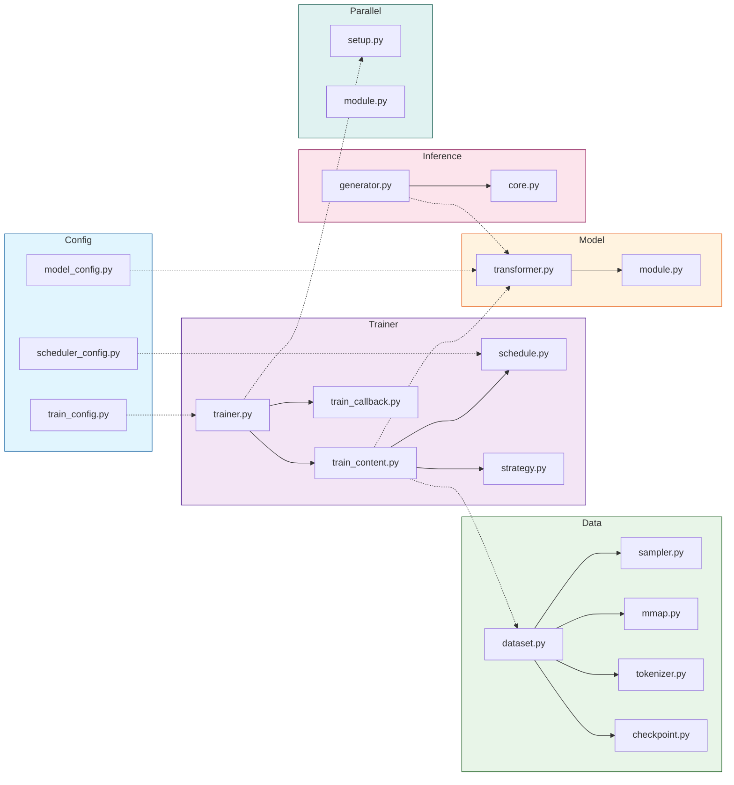

## 1. Why I Created This Project

There are many large language models on the market today, such as GPT, LLaMA, and others, with tens of billions or even hundreds of billions of parameters. But honestly, these models have extremely high hardware requirements, making them inaccessible for ordinary developers. I thought: **Can we create a model that is both useful and can run on ordinary computers?** This is also what most people currently hope for - a locally deployable AI project that achieves complete privatization while maintaining some level of intelligence.

Thus, the KHAOSZ project was born - 1B parameters, Chinese-English bilingual, supporting dialogue, text generation, RAG retrieval, and the training code is open source!

## 2. System Architecture

The system is divided into the following modules:

### 1. Configuration Management (/config/)
- **Model Configuration**: Defines model structure parameters (such as layers, heads, dimensions, etc.), managed uniformly through `ModelConfig`.
- **Training Configuration**: Sets training parameters (such as batch size, training stages PT/SFT/DPO, optimizers, etc.), loaded by `TrainConfig`.
- **Scheduler Configuration**: Controls learning rate strategies (such as cosine annealing) and training progress.

### 2. Hardware and Parallelism (/parallel/)
- **Distributed Initialization**: Initializes multi-GPU/multi-machine training environments through the `setup_parallel` function according to configuration.

### 3. Data Processing (/data/)
- **Efficient Loading**: Uses memory mapping (mmap) technology to load massive corpora, avoiding memory overflow and achieving zero-copy reading.

### 4. Model and Training (/model/, /trainer/)
- **Unified Model Architecture**: Based on Transformer, supporting flexible configuration of different scales (such as 7B, 13B).
- **Strategy-based Trainer**: `Trainer` automatically switches training strategies according to training stages (PT/SFT/DPO), reusing the same training loop.
- **Training Context Management**: Unifies management of model, optimizer, scheduler, and metrics, supporting seamless multi-stage transitions.

### 5. Inference Service (/inference/, /utils/)
- **Unified Generation Interface**: Provides synchronous, batch, and streaming generation methods, adapting to all training stages.
- **KV Cache Optimization**: Caches Key/Value during autoregressive generation, utilizing high-speed on-chip memory acceleration on NVIDIA GPU.
- **RAG Support**: Combines retriever and embedding models to inject relevant information from external knowledge bases, improving answer quality.
- **Intelligent Text Segmentation**:
  - **Structure-first Segmentation**: Splits by titles, paragraphs, etc.;
  - **Semantic Segmentation**: Based on sentence embedding similarity, ensuring fragment semantic completeness and improving fine-tuning effects.

## 3. Training Process

The common training process for large language models (LLM) typically includes three stages: **Pre-training (PT)**, **Supervised Fine-Tuning (SFT)**, and **Reinforcement Learning from Human Feedback (RLHF)**. This system is designed to support seamless end-to-end flow, achieving efficient switching and state management of different training stages through modular strategies, ensuring the model's capabilities gradually evolve from general language understanding to human-preference-aligned dialogue and instruction execution.

### **2.1 Pre-training Stage**

The pre-training stage aims to build the model's foundational language capabilities and general knowledge representation. This stage performs self-supervised learning on large-scale, unlabeled corpora (typically covering hundreds of GB to TB of text data). The model architecture is based on the standard Transformer Decoder, trained through masked language modeling objectives (such as causal language modeling), enabling the model to learn vocabulary, grammar, semantics, and world knowledge embedded in text.

**Core Formula: Causal Language Modeling**

$$
L_{\text{PT}} = - \sum_{t=1}^{T} \log P(x_t \mid x_{\lt t}; \theta)
$$

**Symbol Description:**

- $T$: Sequence length
- $x_t$: The $t$-th token in the sequence
- $x_{<t}$: All tokens before position $t$
- $\theta$: Model parameters
- $P(x_t \mid x_{<t}; \theta)$: The probability of the model predicting the next token given the preceding context

The core of this stage lies in utilizing distributed parallel computing resources to achieve stable optimization of model parameters. The `PTStrategy` in the trainer module is specifically responsible for managing pre-training-specific data sampling, long sequence segmentation, and gradient accumulation logic. At the same time, the hardware adaptation module automatically selects the optimal parallel communication backend (such as NCCL) based on the runtime environment (such as NVIDIA GPU cluster) and performs computation graph optimization to maximize hardware utilization and training throughput.

Additionally, the system achieves zero-copy reading of massive data through the efficient memory-mapped loader (`MmapFileHandler`) in the data module, overcoming traditional IO bottlenecks.

### **2.2 Supervised Fine-Tuning Stage**

Although pre-trained models possess powerful language generation capabilities, they are not yet aligned with following human instructions and engaging in safe, helpful dialogues. The supervised fine-tuning stage aims to bridge this gap. This stage uses high-quality instruction-response paired datasets carefully written by humans.

**Core Formula: Sequence-to-Sequence Conditional Language Modeling**

Let the complete sequence $S = [s_1, s_2, \ldots, s_{P+L}]$, where:

- The first $P$ tokens are prompts and corresponding control tokens: $X = [s_1, \ldots, s_P]$
- The last $L$ tokens are responses and corresponding control tokens: $Y = [s_{P+1}, \ldots, s_{P+L}]$

The loss function is:

$$
L_{\text{SFT}} = - \sum_{t=P+1}^{P+L} \log P(s_t \mid s_{\lt t}; \theta)
$$

The trainer module dynamically switches to the `SFTStrategy`. The core of this strategy is introducing sequence-level supervised learning objectives, such as predicting complete, correct response sequences given instructions. The training context manager (`TrainContext`) is responsible for smoothly loading model states from PT stage checkpoints and initializing new optimizers and learning rate schedulers. This stage not only optimizes model parameters but more importantly guides the model to learn the specific task paradigm of "dialogue," making its output style, content, and format conform to human expectations.

### **2.3 Reinforcement Learning from Human Feedback Stage**

To generate outputs that are more helpful, harmless, and aligned with human preferences, the system further integrates a reinforcement learning stage. The traditional RLHF process includes two core steps: **Reward Model Training** and **Policy Model Fine-tuning**. The system supports policy fine-tuning represented by the Direct Preference Optimization (DPO) algorithm, with multiple engineering optimizations for stability and convergence.

#### **2.3.1 Traditional RLHF (Reward Model Training)**

$$
L_{\text{RM}} = -\mathbb{E}_{(x, y_w, y_l) \sim D} \left[ \log \sigma\left( r_\phi(x, y_w) - r_\phi(x, y_l) \right) \right]
$$

**Symbol Description:**

- $r_\phi(x, y)$: The scalar score given by the reward model with parameters $\phi$
- $y_w, y_l$: The preferred and dispreferred responses for the same prompt $x$
- $\sigma$: Sigmoid function
- $\mathcal{D}$: Human preference dataset

#### **2.3.2 DPO Direct Preference Optimization** (Recommended)

$$
L_{\text{DPO}} = -E_{(x, y_w, y_l) \sim D} \left[ \log \sigma\left( \beta \log \frac{\pi_\theta(y_w \mid x)}{\pi_{\text{ref}}(y_w \mid x)} - \beta \log \frac{\pi_\theta(y_l \mid x)}{\pi_{\text{ref}}(y_l \mid x)} \right) \right]
$$

**Symbol Description:**

- $\pi_\theta(y \mid x)$: The probability of the current policy model generating response $y$
- $\pi_{\text{ref}}(y \mid x)$: The probability of the reference model generating response $y$
- $\beta$: Temperature parameter (typically set to 0.1-0.5)
- Note: Implicitly learning reward function $r(x, y) = \beta \log \frac{\pi_\theta(y \mid x)}{\pi_{\text{ref}}(y \mid x)}$

In this stage, the trainer module enables the `RLHFStrategy` (or similar `DPOStrategy` direct preference optimization strategy). This strategy manages a complex training loop containing the policy model (LLM to be optimized), reference model (usually an SFT model snapshot), and reward model. The system flow is as follows:

1. **Preference Data Collection and Reward Modeling**: First, by collecting human annotators' ranking preferences for multiple model-generated results for the same prompt, a separate reward model (RM) is trained. This model learns to output a scalar reward score for generated text to quantify the degree of alignment with human preferences.
2. **Policy Optimization**: Then, using the reward model as the optimization signal, the SFT model (as the policy) is fine-tuned through reinforcement learning algorithms. The goal of policy optimization is to maximize the expected cumulative reward obtained from the reward model, while constraining the output distribution of the policy model and reference model from deviating too much through a KL divergence penalty term, preventing mode collapse and maintaining generation diversity. The training context manager maintains the states of the policy model, reference model, and reward model (or value function model) simultaneously at this stage, and coordinates complex multi-stage gradient computations.

Through the above three-stage progressive training, the model completes its evolution from a general language foundation to a specialized, highly-aligned dialogue intelligence. The system, through unified `Trainer` interface and strategy pattern design, makes each stage of training highly reusable at the code level, clearly decoupled at the process level, providing an efficient, flexible, and scalable engineering foundation for large-scale language model research and iteration.