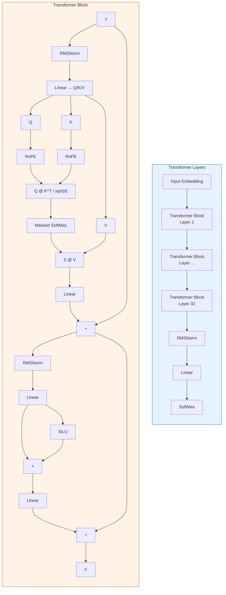

## Model Introduction

### 1. Model Architecture

This model uses the Transformer architecture with GQA mechanism (q_head=24, kv_head=4), which saves KV cache memory compared to traditional MHA (although KV cache is not currently implemented). The model is built by stacking 32 layers of Transformer blocks, with 1.0 billion parameters. Transformer is an autoregressive model that calculates the relationship between all previous tokens to obtain the probability distribution of the next token.

The model now uses the **AutoModel** base class for flexible loading and saving:

```python
from astrai.model import AutoModel

# Load model from checkpoint
model = AutoModel.from_pretrained("path/to/model")

# Save model to new directory
model.save_pretrained("path/to/save")
```

The Transformer model is registered via `@AutoModel.register('transformer')` decorator, allowing easy extension for new model types.


```mermaid
flowchart TB
    subgraph Layers["Transformer Layers"]
        direction TB
        A[Input Embedding] --> B[Transformer Block\nLayer 1]
        B --> C[Transformer Block\nLayer ...]
        C --> D[Transformer Block\nLayer 32]
        D --> E[RMSNorm]
        E --> F[Linear]
        F --> G[SoftMax]
    end

    subgraph TransformerBlock["Transformer Block"]
        direction TB
        H[x] --> I[RMSNorm]
        I --> J[Linear → Q/K/V]
        J --> K[Q]
        J --> L[K]
        J --> M[V]
        K --> N[RoPE]
        L --> O[RoPE]
        N --> P["Q @ K^T / sqrt(d)"]
        O --> P
        P --> Q[Masked SoftMax]
        Q --> R[S @ V]
        M --> R
        R --> S[Linear]
        S --> T[+]
        H --> T
        T --> U[RMSNorm]
        U --> V[Linear]
        V --> W[SiLU]
        V --> X[×]
        W --> X
        X --> Y[Linear]
        Y --> Z[+]
        T --> Z
        Z --> AA[x']
    end

    classDef main fill:#e6f3ff,stroke:#0066cc;
    classDef block fill:#fff2e6,stroke:#cc6600;
    class Layers main;
    class TransformerBlock block;
```

What is an autoregressive model? After splitting a sentence into tokens, the model predicts the probability distribution of the next token. This means the model calculates the probability of the next possible token and its corresponding probability based on the given context (the sequence of tokens that have already appeared).

#### 1. Autoregression

In autoregressive modeling, when a sentence is tokenized into a sequence of tokens, the model learns to predict what comes next. Given a sequence of tokens as input, the model calculates a probability distribution over all possible next tokens. This distribution tells us how likely each potential next token is, given the current context.

For instance, if the input sequence contains tokens representing a question, the model might predict that certain response tokens have higher probabilities than others. The sampling process then selects one token from this distribution—controlled by parameters like top_k, top_p, and temperature—to serve as the next token in the sequence.

Once a token is selected, it is appended to the input sequence, and the model repeats this process. The updated sequence is then fed back into the model to predict the next token. This iterative process continues until either a special end-of-sequence token is generated, or the maximum sequence length is reached. These control tokens are essential because without them, the model would continue generating tokens indefinitely, eventually exhausting available memory.

#### 2. Causal Mask

Transformers use attention mechanism. The input shape is generally [bsz, seq_len], and the output is [bsz, seq_len, n_dim]. To predict the next token, the model's input and output must be offset by one position. The target predicted by the model must be offset by one position, and during training we also use the offset-by-one method:

```
sequence : [[1, 2, 3, 4, 5, 6]]
input_ids: [[1, 2, 3, 4, 5]]
target_ids: [[2, 3, 4, 5, 6]]
```

The attention score calculation formula is:

$$ s_{ij} = softmax(\frac{q_i^Tk_j}{\sqrt{d_k}}) $$
$$ s_{ij} := s_{ij} + mask_{ij} $$

Here, the attention score represents the degree to which the model attends to the similarity between two tokens.

For decoder-only structure models, to prevent the model from "stealing" information from future positions, a mask needs to be added during attention calculation. We need to apply a mask before attention score calculation. This mask is typically a lower triangular matrix, and for a sequence of length n, its shape is [n, n]. Below is an example of how to create such a causal mask matrix for a sequence of length 5:

```
[[0, -inf, -inf, -inf, -inf],
 [0,    0, -inf, -inf, -inf],
 [0,    0,    0, -inf, -inf],
 [0,    0,    0,    0, -inf],
 [0,    0,    0,    0,    0]]
```

In this matrix, 0 represents positions that can be attended to, while -inf represents positions that should be masked (i.e., should not be attended to). Because this matrix ensures that after the softmax, the parts of the attention scores where $j > i$ change from `inf` to 0, meaning the model cannot see future information.

#### 3. Rotary Position Embedding

Rotary Position Embedding (RoPE) is a position encoding method designed to solve the problem of lacking direct modeling of sequence position information in Transformer models. Unlike traditional position encodings (such as sine and cosine function position encodings), RoPE embeds position information directly into the Query (Q) and Key (K) vectors, allowing the model to more naturally handle relative position relationships in sequences.

$$ q_i = R_i W_q x_i $$
$$ k_j = R_j W_k x_j $$
$$ q_i^T k_j = (R_i W_q x_i)^T( R_j W_k x_j) = x_i^T W_q^T R_{i-j} W_k x_j $$

The $R_{i-j}$ controls the attenuation of attention for different tokens at different relative distances. When the absolute value of $i - j$ is larger, the degree of attenuation is stronger. This approach allows the model to learn relative position relationships, enabling the model to scale and adapt to longer sequences.

## KV Cache Implementation

According to the attention calculation formula:

$$
\begin{align*}
o_i &= \sum_j s_{ij} v_{j} \newline
s_{ij} &= \text{softmax}\left( \frac{q_{i} k_{j}}{\sqrt{d_k}} \right)
\end{align*}
$$

Since the model is an autoregressive model, we only need to calculate for the last part of the sequence, meaning the index $i$ is fixed as the last element of the sequence, and we compute $o_{n}$:

$$
\begin{align*}
o_n &= \sum_j s_{j}v_{j} \newline
s_j &= \text{softmax}\left(\frac{q_n k_{j}}{\sqrt{d_k}} \right)
\end{align*}
$$

If we expand the expression:

$$
o_n = \sum_j \text{softmax}\left(\frac{q_n k_{j}}{\sqrt{d_k}}\right)v_{j}
$$

In the above expression, only k and v have length indices, while $q$ does not. Therefore, during the calculation process, the input of $q$ is fixed as the last token from the previous input, while $k$ and $v$ need to be cached for parts of different lengths. Also, when caching, note that position encoding calculation should be performed before KV cache computation, otherwise there will be position encoding calculation errors.