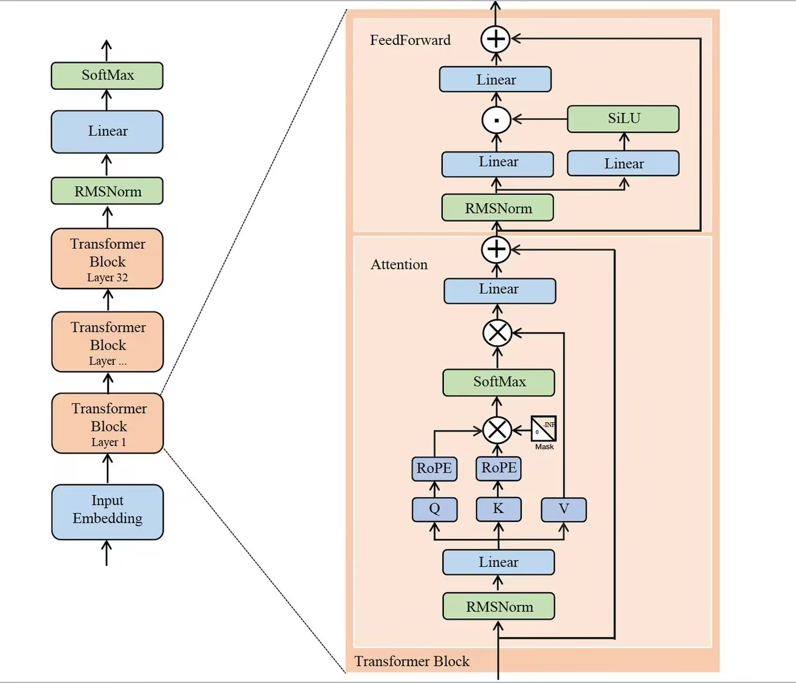

## 模型介绍


### 1. 模型搭建

本模型采用Transformer架构， 使用GQA（q_head=24, kv_head=4） 机制，相较于传统的MHA可以节省KV cache 的显存占用（但是目前没有做KV cache），通过堆叠24层Transformer实现模型的搭建， 参数量为1.0b。Transformer 是自回归模型， 是通过计算前面所有的token的关系得到下一个token的概率分布



什么是自回归模型呢， 在把句子拆分成token之后, 模型会预测下一个token的概率分布。这意味着模型会根据给定的上下文（即已经出现的tokens序列），计算出下一个可能的token及其对应的概率。


#### 1. 自回归

假设我们有一个句子被拆分成如下tokens列表：

```
["你好", "，" "今天", "天气"]
```

接下来，模型会基于这个序列预测下一个可能出现的token。这通常以概率分布的形式给出，比如：

```
-> {"token": "不错", "probability": 0.4}
-> {"token": "晴朗", "probability": 0.2}
-> ......
```

这里，“不错”和“晴朗”是两个可能跟随在“天气”之后的tokens，并且给出了每个token成为下一个token的可能性大小。

之后，我们通过采样（通过top_k, top_p, temperature参数调整采样后的结果）得到下一个token并且将下一个token加入序列作为输入

```
["你好", "，" "今天", "天气", "不错"]
```

之后都是在重复这个流程， 直到遇到控制流程结束的token（<|end_of_seqence|>）模型停止处理（一般模型都会设置控制token， 不然模型会一直输出到显存爆炸）。 


#### 2. 因果掩码

transformer 中采用注意力机制，输入的形状一般为[bsz, seq_len]， 输出为[bsz, seq_len，n_dim]， 为了实现预测下一个token， 模型的输入和输出必须错开来一个位置。模型预测的target必须错开一个位置， 在训练的时候我们也采用错开一个位置的方法

```
sequence : [[1, 2, 3, 4, 5, 6]]
input_ids: [[1, 2, 3, 4, 5]]
target_ids: [[2, 3, 4, 5, 6]]
```


注意力得分计算的公式为


$$ s_{ij} = softmax(\frac{q_i^Tk_j}{\sqrt{d_k}}) $$
$$ s_{ij} := s_{ij} + mask_{ij} $$


其中注意力得分代表了模型对两个token之间相似程度的关注程度

对于decoder only结构的模型， 为了防止模型从未来的位置偷到信息， 在注意力的计算过程中需要增加掩码，我们需要在注意力得分计算之前应用一个掩码。这个掩码通常是一个下三角矩阵，对于长度为n的序列，它的形状是[n, n]。下面以一个长度为5的序列为例，展示如何创建这样的因果掩码矩阵：

```
[[0, -inf, -inf, -inf, -inf],
 [0,    0, -inf, -inf, -inf],
 [0,    0,    0, -inf, -inf],
 [0,    0,    0,    0, -inf],
 [0,    0,    0,    0,    0]]
```

在这个矩阵中，0表示可以注意到的位置，而-inf表示应该被掩盖（即不应注意到）的位置。因为这个句子保证了注意力得分中 $j > i$  的部分通过softmax 之后由`inf` 变成0， 也就是模型不能看到未来的信息


#### 3. 旋转位置编码

旋转位置编码（Rotary Position Embedding, RoPE）是一种为了解决Transformer模型中缺乏对序列位置信息直接建模的问题而设计的位置编码方法。与传统的位置编码（如正弦和余弦函数的位置编码）不同，RoPE通过将位置信息直接嵌入到查询（Query, Q）和键（Key, K）向量中来实现，使得模型能够更自然地处理序列中的相对位置关系。


$$ q_i = R_i W_q x_i $$
$$ k_j = R_j W_k x_j $$
$$ q_i^T k_j = (R_i W_q x_i)^T( R_j W_k x_j) = x_i^T W_q^T R_{i-j} W_k x_j $$

其中的 $R_{i-j}$ 控制了模型的不同token 在不同相对距离上注意力的衰减，在 $i - j$ 绝对值越大的时候， 衰减的程度越强， 通过这种方式能让模型学习到相对位置关系， 从而使得模型可以扩展和适应长序列