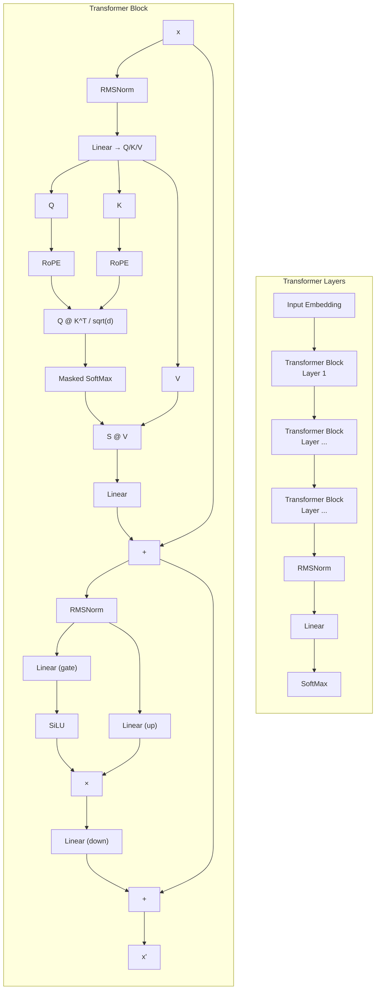

# Training

## Model Architecture

The model uses a decoder-only Transformer with **GQA** (Grouped Query Attention) and optional **MLA** (Multi-head Latent Attention). 1.0 billion parameters, Chinese–English bilingual.



### Autoregression

Given a token sequence, the model predicts the probability of the next token. Each generated token is appended to the input and fed back, repeating until an end-of-sequence token or max length.

### Causal Mask

```
sequence : [[1, 2, 3, 4, 5, 6]]
input_ids: [[1, 2, 3, 4, 5]]
target_ids: [[2, 3, 4, 5, 6]]
```

Lower-triangular mask prevents attending to future positions:

```
[[0, -inf, -inf, -inf, -inf],
 [0,    0, -inf, -inf, -inf],
 [0,    0,    0, -inf, -inf],
 [0,    0,    0,    0, -inf],
 [0,    0,    0,    0,    0]]
```

### Rotary Position Embedding (RoPE)

RoPE embeds position into Q/K vectors via complex rotation:

$$ q_i = R_i W_q x_i, \quad k_j = R_j W_k x_j, \quad q_i^T k_j = x_i^T W_q^T R_{i-j} W_k x_j $$

The complex rotation `freqs_cis` is pre-computed once (`cos, sin` pairs per position). `apply_rotary_emb` multiplies Q/K as complex numbers.

## Training Loop

Two-level loop: **epoch** → **batch**. Optimizer step fires every `grad_accum_steps` batches.

```
on_train_begin
  on_epoch_begin
    for batch in dataloader:
      on_batch_begin
      loss = strategy(batch)
      (loss / grad_accum_steps).backward()
      iteration += 1
      on_batch_end

      if iteration % grad_accum_steps == 0:
        on_step_begin
        optimizer.step()
        optimizer.zero_grad()
        on_step_end
        scheduler.step()
    on_epoch_end
on_train_end
```

### Callback Lifecycle

| Hook | Fires | Default callback |
|------|-------|-----------------|
| `on_step_begin` | Every accumulation window | `GradientClippingCallback` |
| `on_batch_end` | Every batch | `CheckpointCallback`, `MetricLoggerCallback`, `ProgressBarCallback` |
| `on_train_end` | Training ends | `CheckpointCallback`, `MetricLoggerCallback` (final save) |

Default callbacks: `progress_bar` (tqdm), `checkpoint` (safetensors, rank-0), `metric_logger` (JSONL, rank-0), `gradient_clipping`.

## Strategies

### SEQ (Pre-training)

Next-token cross-entropy with optional label smoothing:

$$
L_{\text{PT}} = -\sum_{t=1}^{T} \log P(x_t \mid x_{\lt t}; \theta)
$$

Keys: `input_ids`, `target_ids`

### SFT (Supervised Fine-Tuning)

Masked cross-entropy (`ignore_index=-100`) over response tokens:

$$
L_{\text{SFT}} = -\sum_{t=P+1}^{P+L} \log P(s_t \mid s_{\lt t}; \theta)
$$

Keys: `input_ids`, `target_ids`, `loss_mask`

### DPO (Direct Preference Optimization)

Frozen reference model, preference margin via log-ratio:

$$
L_{\text{DPO}} = -\mathbb{E}\left[\log\sigma\left(\beta\log\frac{\pi_\theta(y_w\mid x)}{\pi_{\text{ref}}(y_w\mid x)} - \beta\log\frac{\pi_\theta(y_l\mid x)}{\pi_{\text{ref}}(y_l\mid x)}\right)\right]
$$

Parameters: `beta=0.1`. Keys: `chosen`, `rejected`, `chosen_mask`, `rejected_mask`.

### GRPO (Group Relative Policy Optimization)

On-policy PPO with group-normalized advantages:

$$
\text{Advantage}_i = \frac{r_i - \mu}{\sigma + \epsilon}
$$

$$
L_{\text{GRPO}} = -\mathbb{E}\left[\min\left(\frac{\pi_\theta}{\pi_{\text{ref}}}A,\; \text{clip}\left(\frac{\pi_\theta}{\pi_{\text{ref}}}, 1-\epsilon, 1+\epsilon\right)A\right)\right] + \lambda \cdot \mathbb{E}\left[(\log\pi_\theta - \log\pi_{\text{ref}})^2\right]
$$

Parameters: `group_size=4`, `clip_eps=0.2`, `kl_coef=0.01`, `sync_interval=200`.

Keys: `prompts`, `responses`, `masks`, `rewards`.

## LR Schedulers

| Type | Class | Description |
|------|-------|-------------|
| Cosine | `CosineScheduler` | Linear warmup → cosine decay to `min_rate` |
| SGDR | `SGDRScheduler` | Cosine annealing with warm restarts (`t_mult=2`) |

Created by `SchedulerFactory.create(optimizer, schedule_type, **kwargs)`.

## Checkpoint

```
Checkpoint(state_dict, epoch, iteration, extra, meta)
  ├── save(save_dir)    rank-0 only: meta.json (includes training config) + state_dict.safetensors + optional extra.pt
  └── load(save_dir)    broadcasts metadata from rank-0
```

Optimizer/scheduler state persisted by default via `Checkpoint.extra`.  
Training config (`TrainConfig.to_dict()`) saved into `meta.json` during training via `CheckpointCallback`.

## TrainContextBuilder (Builder Pattern)

```python
context = (
    TrainContextBuilder(config)
        .with_checkpoint(checkpoint)
        .build()
)
# Returns TrainContext with model, strategy, optimizer, scheduler, dataloader, checkpoint
```

- Loads checkpoint weights if provided
- Wraps model with `parallel_wrapper` if `nprocs > 1`
- Creates `ResumableDistributedSampler` for shuffle+resume
- Builds strategy via `StrategyFactory.create(train_type, ...)`

## Training CLI

```bash
export CUDA_VISIBLE_DEVICES=0,1,2,3

nohup python scripts/tools/train.py \
    --nprocs=4 \
    --train_type=sft \
    --data_root_path=/path/to/dataset \
    --param_path=/path/to/model \
    --batch_per_device=4 \
    --grad_accum_steps=8 \
    --warmup_ratio=0.05 \
    --max_lr=1e-4 \
    --max_grad_norm=1.0 \
    --adamw_beta1=0.99 \
    --adamw_beta2=0.95 \
    --adamw_weight_decay=1e-5 \
    --window_size=2048 \
    --ckpt_interval=10000 \
    --ckpt_dir=./checkpoint \
    --random_seed=3407 \
    --label_smoothing=0.1 \
    > out.log 2> err.log &
```

Full parameter reference at [params.md](params.md).

> Document Update Time: 2026-05-16
